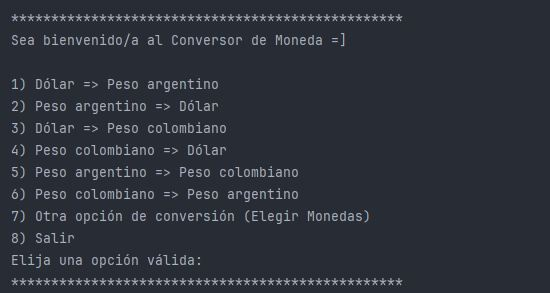
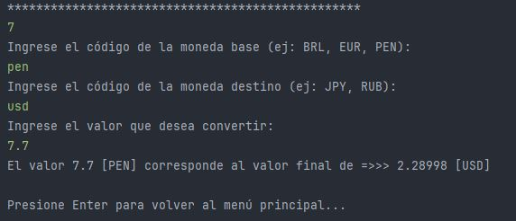

# 💱 Conversor de Monedas - Challenge Alura

<p align="left">
   
   
   
</p>

Bienvenido al **Conversor de Monedas**, un proyecto desarrollado como parte del desafío de programación de **Alura Latam (Oracle Next Education)**. Esta aplicación de consola permite realizar conversiones de divisas en tiempo real consumiendo una API externa y guarda un historial de las transacciones.

## 🚀 Características

* **Menú Interactivo:** Interfaz de consola fácil de usar con opciones predefinidas.
* **Conversión en Tiempo Real:** Utiliza la **ExchangeRate-API** para obtener las tasas de cambio más actuales.
* **Monedas Soportadas:**
    * Conversiones directas entre USD (Dólar), ARS (Peso Argentino) y COP (Peso Colombiano).
    * **Opción Personalizada:** Permite ingresar códigos de moneda manualmente (ej. BRL, EUR, PEN, JPY) para realizar cualquier conversión soportada por la API.
* **Historial de Conversiones:** Cada operación exitosa se guarda automáticamente en un archivo `historial_conversiones.txt` con fecha y hora exacta.
* **Validaciones:** Control de errores para entradas no numéricas y códigos de moneda inválidos (validación de longitud y existencia).
* **Manejo de Errores:** Sistema robusto que evita que la aplicación se cierre inesperadamente ante fallos de conexión o inputs erróneos.

## 🛠️ Tecnologías Utilizadas

* **Java (JDK):** Lenguaje principal del proyecto.
* **Gson (Google):** Librería para parsear el JSON recibido de la API a objetos Java.
* **Java HTTP Client:** Para realizar las peticiones `GET` a la API.
* **Java IO & Time:** Para la generación de archivos y manejo de fechas (`LocalDateTime`).

## 📂 Estructura del Proyecto

El proyecto sigue una arquitectura organizada por paquetes para separar responsabilidades:

```text
src/com/aluracursos/conversormonedas/
├── calculos/
│   ├── CalcularConversion.java      # Lógica matemática y validación de tasas
│   └── ObtenerTarifasConversion.java # Intermediario entre la conexión y el cálculo
├── conexion/
│   └── Conexion.java                # Cliente HTTP y petición a la API
├── modelos/
│   └── Moneda.java                  # Java Record para modelar la respuesta JSON
├── principal/
│   ├── Principal.java               # Clase Main, bucle de ejecución y control de flujo
│   └── MenuPrincipal.java           # Interfaz visual (textual) del menú
└── utils/
    └── GeneradorDeArchivos.java     # Lógica para guardar el historial en .txt
```

## 📋 Prerrequisitos y Ejecución
Clonar el repositorio:

```bash
git clone [https://github.com/tu-usuario/conversor-de-monedas.git](https://github.com/tu-usuario/conversor-de-monedas.git)
```

* **Importar el proyecto:** Abrir en tu IDE favorito (IntelliJ IDEA, Eclipse).

* **Dependencias:** Asegúrate de tener la librería Gson añadida a tu proyecto (o configurada en el module-info.java / pom.xml si usas gestores de dependencias).

* **Ejecutar:** Busca la clase Principal.java y ejecuta el método main.

## 💻 Ejemplo de Uso
Al iniciar el programa, verás el siguiente menú:

<p align="center">
  
</p>

Y al poner los datos requeridos, te saldrá el siguiente resultado:
<p align="center">
  
</p>

## 📋 Historial Generado (historial_conversiones.txt)
El programa generará automáticamente un registro como este:
<p align="center">
  
</p>

## 🔒 Nota sobre la API Key
Este proyecto utiliza una clave de API gratuita de ExchangeRate-API. Para uso en producción, se recomienda configurar esta clave como una variable de entorno en lugar de incluirla directamente en el código fuente.

## 👤 Autor
Desarrollado por Yadira Gamboa.

Proyecto realizado para fines educativos en el marco del programa ONE (Oracle Next Education).
